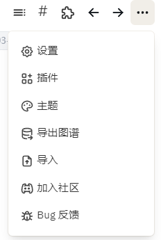

- [[logseq]] 双端同步 简介
	- logseq自带的，最高600秒自动push，每秒进行pull。
	- 插件中的Git，只能每秒自动push，自动pull没试出来。不过可以在header上手动控制git。
	- [CharlesChiuGit/Logseq-Git-Sync-101: This repo aims to help Logseq users to sync their data with Git and GitHub.](https://github.com/CharlesChiuGit/Logseq-Git-Sync-101)
	-
	- ~~试试这个白板来介绍win端有两个功能可以同步~~
		- [[draws/2023-03-31-14-48-59.excalidraw]]
			- 
			-
- 今日[[logseq]]发布第一个0.9beta版本，白板功能试用
  collapsed:: true
	- [Changelog (logseq.com)](https://docs.logseq.com/#/page/changelog)
	- [[draws/2023-03-31-14-43-56.excalidraw]]
	-
-