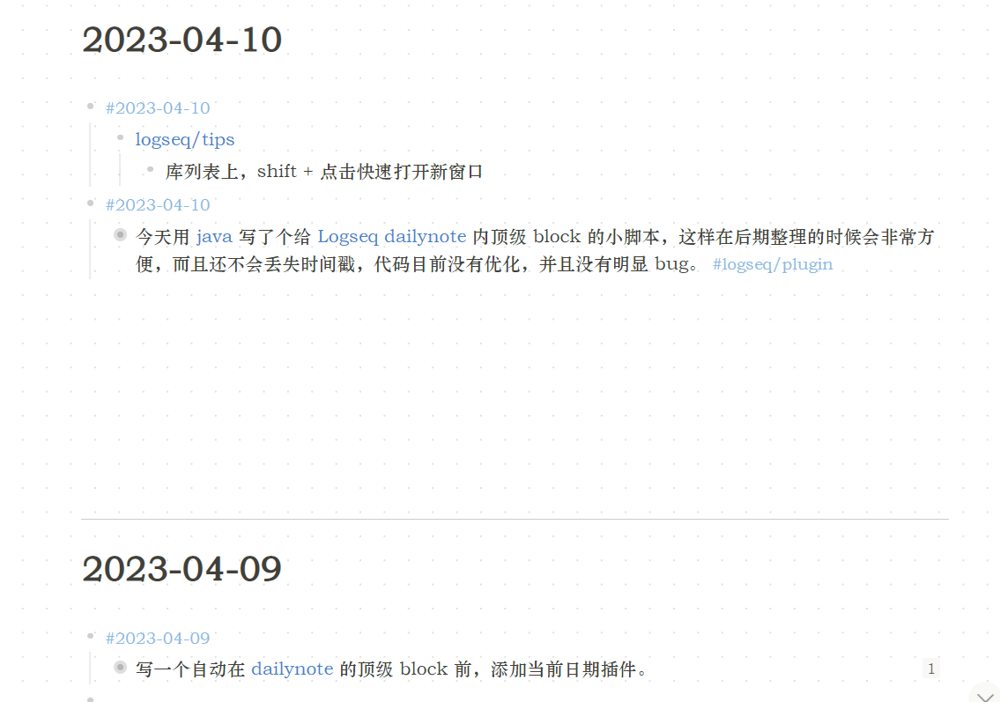

- #2023-04-10
	- [[logseq/tips]]
		- 库列表上，shift + 点击快速打开新窗口
- #2023-04-10
	- 今天用[[java]]写了个给[[Logseq]] [[dailynote]] 内顶级block的小脚本，这样在后期整理的时候会非常方便，而且还不会丢失时间戳，代码目前没有优化，并且没有明显bug。 #logseq/plugin
		- 展示
		  collapsed:: true
			- 
		- Code
		  collapsed:: true
			- ```java
			  package org.example;
			  
			  import java.io.*;
			  import java.util.Scanner;
			  import java.util.regex.*;
			  
			  public class FileProcessor {
			  
			      // A method to check if a string matches the pattern #YYYY-MM-DD
			      public static boolean isDate(String s) {
			          Pattern p = Pattern.compile("#\\d{4}-\\d{2}-\\d{2}");
			          Matcher m = p.matcher(s);
			          return m.find();
			      }
			  
			      // A method to process a single file
			      public static void processFile(String fileName,String name) {
			          try {
			              // Create a buffered reader to read the file
			              BufferedReader br = new BufferedReader(new FileReader(fileName));
			  
			              // Create a string builder to store the modified content
			              StringBuilder sb = new StringBuilder();
			  
			              // Create a string variable to store the current date
			              String date = fileName;
			  
			              // Read each line of the file
			              String line = br.readLine();
			              while (line != null) {
			                  // If the line is only "-", skip it and read the next line
			                  if (line.equals("-")) {
			                      sb.append(line).append("\n");
			                      line = br.readLine();
			                      if (line != null) {
			                          int i = 0;
			                          while (i == 0) {
			                              if (line.trim().equals("-")) {
			                                  sb.append(line).append("\n");
			                                  line = br.readLine();
			                                  if (line == null ){
			                                      break;
			                                  }
			                              } else i = 1;
			                          }
			                          continue;
			                      }else {
			                          break;
			                      }
			  
			  
			                  }
			                  // If the line starts with "-", check the text after it
			                  if (line.startsWith("-")) {
			                      // Get the text after "-"
			                      // text = line.substring(1).trim();
			                      // If the text is a date, update the date variable and append the line to the string builder
			                      if (isDate(line)) {
			  
			                          sb.append(line).append("\n");
			  
			                          line = br.readLine();
			  
			                          if (line != null) {
			                              int i = 0;
			                              while (i == 0) {
			  
			                                  if (!line.startsWith("-")) {
			                                      sb.append(line).append("\n");
			                                      line = br.readLine();
			                                      if (line == null ){
			                                          break;
			                                      }
			                                  } else i = 1;
			                              }
			                              continue;
			                          }else {
			                              break;
			                          }
			  
			                      } else {
			                          // If the text is not a date, insert a date line before it and add a tab before the text
			                          date = name.replace("_", "-");;
			                          sb.append("- #").append(date).append("\n");
			                          sb.append("\t").append(line).append("\n");
			                      }
			                  } else {
			                      // If the line does not start with "-", add a tab before it and append it to the string builder
			                      // 和匹配到。
			                      sb.append("\t").append(line).append("\n");
			                  }
			  
			                  // Read the next line
			                  line = br.readLine();
			              }
			  
			              // Close the buffered reader
			              br.close();
			  
			              // Create a buffered writer to write the modified content to the file
			              BufferedWriter bw = new BufferedWriter(new FileWriter(fileName));
			  
			              // Write the string builder content to the file
			              bw.write(sb.toString());
			  
			              // Close the buffered writer
			              bw.close();
			  
			          } catch (IOException e) {
			              // Handle any IO exception
			              e.printStackTrace();
			          }
			      }
			  
			      public static void main(String[] args) {
			          // Get the start date and end date from user input
			  
			  
			  
			          Scanner sc = new Scanner(System.in);
			          String startDate;
			          String endDate;
			  
			          long start;
			          long end;
			  
			          int i = 1;
			          if (i == 0 ) {
			  
			              if (!sc.nextLine().equals("y")) {
			                  System.out.println("请输入开始日期（格式为YYYY_MM_DD）：");
			                  startDate = sc.nextLine();
			                  System.out.println("请输入结束日期（格式为YYYY_MM_DD）：");
			                  endDate = sc.nextLine();
			  
			              } else {
			                  startDate = "0";
			                  endDate = "99999999";
			  
			              }
			          }else {
			              startDate = "0";
			              endDate = "99999999";
			  
			          }
			  
			          sc.close();
			  
			          // Convert the dates to long values for comparison
			           start = Long.parseLong(startDate.replace("_", ""));
			           end = Long.parseLong(endDate.replace("_", ""));
			  
			          // Create a file object for the folder that contains the files
			          File folder = new File("D:\\Logseq\\journals");
			  
			          // Get an array of files in the folder
			          File[] files = folder.listFiles();
			  
			          // Loop through each file in the folder
			          for (File file : files) {
			              // Get the file name without extension
			              String fileName = file.getName().split("\\.")[0];
			  
			              // Convert the file name to a long value for comparison
			              long fileDate = Long.parseLong(fileName.replace("_", ""));
			  
			              // If the file name is within the start and end dates, process the file
			              if (fileDate >= start && fileDate <= end) {
			                  processFile(file.getPath(),fileName);
			              }
			          }
			      }
			  }
			  
			  ```