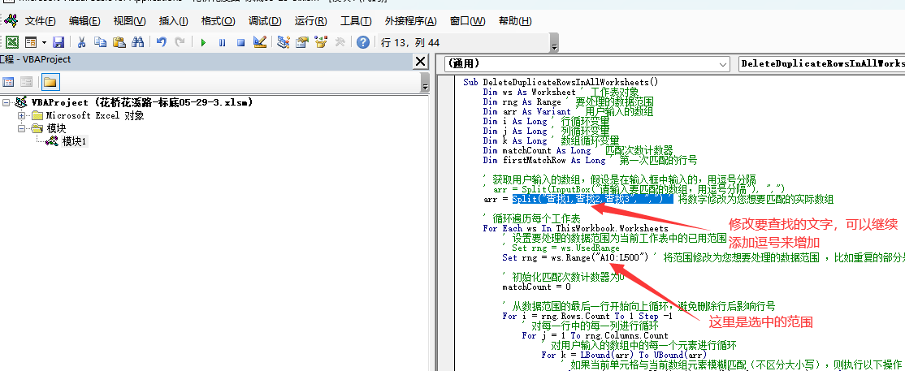
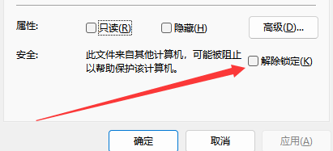
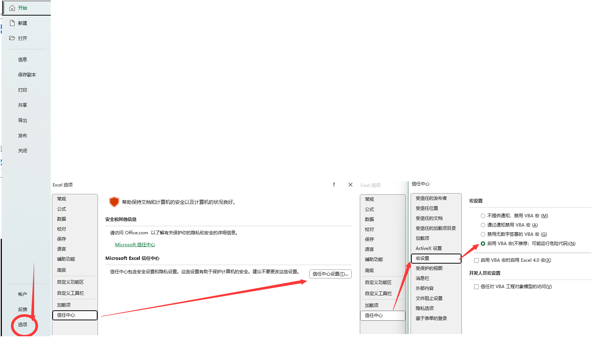
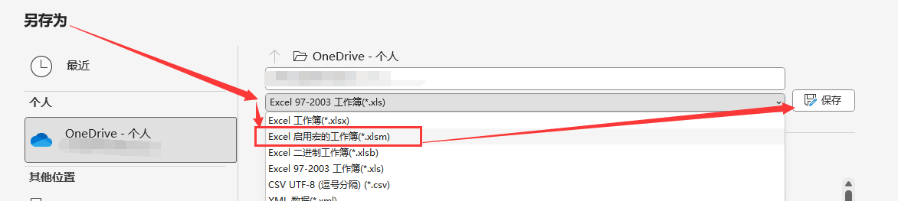
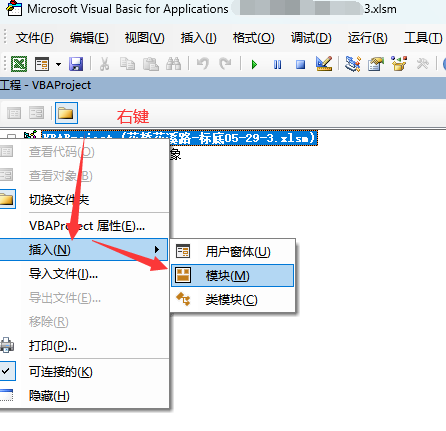
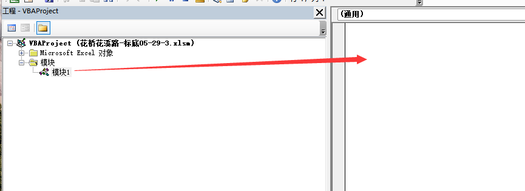
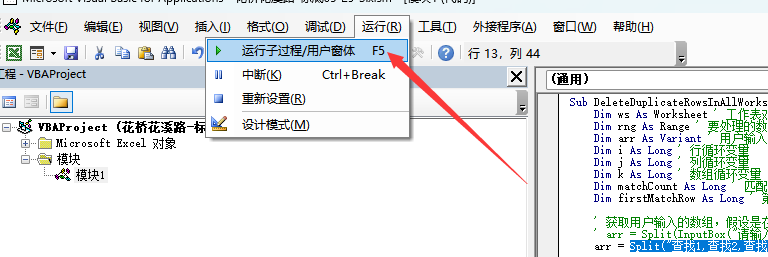

- [[Excel/VBA]] 删除重复的行，并删除空白行
  id:: 64755127-5443-483a-924c-fc8d32d71869
	- code
	  collapsed:: true
		- ```vba
		  Sub DeleteDuplicateRowsInAllWorksheets()
		      Dim ws As Worksheet ' 工作表对象
		      Dim rng As Range ' 要处理的数据范围
		      Dim arr As Variant ' 用户输入的数组
		      Dim i As Long ' 行循环变量
		      Dim j As Long ' 列循环变量
		      Dim k As Long ' 数组循环变量
		      Dim matchCount As Long ' 匹配次数计数器
		      Dim firstMatchRow As Long ' 第一次匹配的行号
		      
		      ' 获取用户输入的数组，假设是在输入框中输入的，用逗号分隔
		      ' arr = Split(InputBox("请输入要匹配的数组，用逗号分隔"), ",")
		      arr = Split("查找1,查找2,查找3", ",") ' 将数字修改为您想要匹配的实际数组
		  
		      ' 循环遍历每个工作表
		      For Each ws In ThisWorkbook.Worksheets
		          ' 设置要处理的数据范围为当前工作表中的已用范围
		          ' Set rng = ws.UsedRange
		          Set rng = ws.Range("A10:L500") ' 将范围修改为您想要处理的数据范围 ，比如重复的部分是表头，那么就不能处理前面几行。
		  
		          ' 初始化匹配次数计数器为0
		          matchCount = 0
		          
		          ' 从数据范围的最后一行开始向上循环，避免删除行后影响行号
		          For i = rng.Rows.Count To 1 Step -1
		              ' 对每一行中的每一列进行循环
		              For j = 1 To rng.Columns.Count
		                  ' 对用户输入的数组中的每一个元素进行循环
		                  For k = LBound(arr) To UBound(arr)
		                      ' 如果当前单元格与当前数组元素模糊匹配（不区分大小写），则执行以下操作
		                      If InStr(1, rng.Cells(i, j), arr(k), vbTextCompare) > 0 Then
		                          ' 如果是第一次匹配，则记录第一次匹配的行号，并将匹配次数计数器加1
		                          If matchCount = 0 Then
		                              firstMatchRow = i
		                              matchCount = matchCount + 1
		                          ' 如果不是第一次匹配，则删除当前行，并将匹配次数计数器加1
		                          Else
		                              rng.Rows(i).Delete
		                              matchCount = matchCount + 1
		                          End If
		                          ' 跳出当前数组循环，继续下一列循环
		                          Exit For
		                      End If
		                  Next k
		              Next j
		              ' 如果当前行没有匹配任何数组元素，则重置匹配次数计数器为0，并清空第一次匹配的行号
		              If matchCount = 0 Then
		                  firstMatchRow = Empty ' 如果当前行匹配了某些数组元素，并且当前行不是第一次匹配的行，则重置匹配次数计数器为1，并更新第一次匹配的行号为当前行号
		              ElseIf i <> firstMatchRow Then
		              matchCount = 1
		              firstMatchRow = i
		              End If
		              Next i
		  
		      ' 删除空白行
		      For i = rng.Rows.Count To 1 Step -1
		          ' 检查每一行是否为空白
		          If WorksheetFunction.CountA(rng.Rows(i)) = 0 Then
		              ' 如果为空白，则删除该行
		              rng.Rows(i).Delete
		          End If
		      Next i
		  Next ws
		  End Sub
		  
		  ```
	- 提示
	  collapsed:: true
		- 
- [[Excel/VBA]] VBA代码使用教程
  id:: 64755189-4989-4cd0-8520-2caba98aab03
  collapsed:: true
	- 解除Excel默认限制宏
	  logseq.order-list-type:: number
		- 若带宏的Excel下载至网络，则会默认禁止宏的使用。比如从这里下载[Excel Regex Replace examples](https://cdn.ablebits.com/excel-tutorials-examples/excel-regex-replace.xlsm) 正则代码的示例XLSM文件。
		  logseq.order-list-type:: number
		  collapsed:: true
			- 解决方法：
			  logseq.order-list-type:: number
				- 
				  logseq.order-list-type:: number
		- Excel默认禁止宏文件
		  logseq.order-list-type:: number
		  collapsed:: true
			- 解决方法
			  logseq.order-list-type:: number
				- 
				  logseq.order-list-type:: number
	- 将Excel另存为XLSM格式。
	  logseq.order-list-type:: number
		- 
		  logseq.order-list-type:: number
	- 按 ALT + F11 打开VBA
	  logseq.order-list-type:: number
	- 插入模块
	  logseq.order-list-type:: number
		- 
		  logseq.order-list-type:: number
		- 如图
		  logseq.order-list-type:: number
			- 
			  logseq.order-list-type:: number
	- 黏贴相关代码
	  logseq.order-list-type:: number
		- 比如这个：
		  logseq.order-list-type:: number
		  collapsed:: true
			- {{embed ((64755127-5443-483a-924c-fc8d32d71869))}}
			  logseq.order-list-type:: number
		- 粘贴示例
		  logseq.order-list-type:: number
		  collapsed:: true
			- 
			  logseq.order-list-type:: number
	- 运行
	  logseq.order-list-type:: number
		- 
		  logseq.order-list-type:: number
	- 撒花🥳🥳🥳🥳
	  logseq.order-list-type:: number