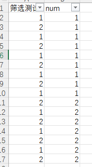

- x 1.09
-
- [[Excel]]
	- [[Excel/筛选]]
		- 筛选-删除重复值 #Excel/致命错误
		  id:: 64858e4e-9e01-4836-aeda-e5912fb88af0
			- 会删除非筛选值吗？  [[$red]]==会！ 小心！==
				- 测试1 顺序排序 ，筛选，直接删除重复值，会删除非筛选值
				  collapsed:: true
					- 
				- 测试2 顺序排序 ，筛选，选中可见值 ， 不会删除非筛选值
				  collapsed:: true
					- 
				- 测试3 非顺序排序，筛选，直接删除重复值，同1
				  collapsed:: true
					- 
				- 测试4 非顺序排序，筛选，选中可见值， [[$red]]==无法操作==  | ==代替操作==
			- [[#red]]==**删除筛选结果重复项**==
			  id:: 648a866d-8bdf-441b-add9-a88c48e11a3d
				- 非顺序筛选列表
				- 选中可见值
				- 复制可见值
				- 粘贴至新表
				- 根据某列排序
				- 删除重复值
				- 复制删除后的结果
				- 切换至源筛选列表
				- 用WPS粘贴至可见列表
				- 删除粘贴列表下的所有其他列即可
		- 筛选-粘贴 | #Excel/致命错误
			- 粘贴并不是粘贴在可见单元格，而是从第一个表格按照非筛选顺序展开 非常容易出错
				- 
					- 不连续时，选中可见单元格，也不能粘贴
						- 
			- Excel 粘贴至筛选可见单元格方法
			- 不连续的原因是筛选
				- 解决方法便是
					- 添加筛选控制列
					- 将筛选项目排序到最后，然后再筛选掉，那么整文便是连续的了，就可以粘贴了。
			- ~~我刚刚是怎么在顺选状态下，粘贴成功的。~~
				- 想办法把 某项 先筛选到最后
				- 再隐藏它
				- 再筛选其他
				- 再粘贴
				-
		- ~~删除重复值并汇总~~
		  collapsed:: true
			- 备份表1
			  logseq.order-list-type:: number
				- 辅助列排序列，保证顺序。
				  logseq.order-list-type:: number
				- 生成唯一标识
				  logseq.order-list-type:: number
				- 排序
				  logseq.order-list-type:: number
				- 删除重复值
				  logseq.order-list-type:: number
			- 备份表2
			  logseq.order-list-type:: number
				- 插入透视表
				  logseq.order-list-type:: number
				- 拖入合并项目
				  logseq.order-list-type:: number
				- 拖入汇总项目
				  logseq.order-list-type:: number
				- 拖入筛选项
				  logseq.order-list-type:: number
			-
		-