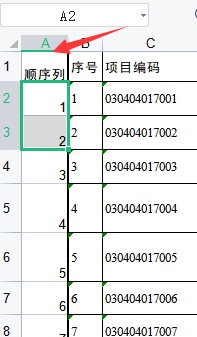
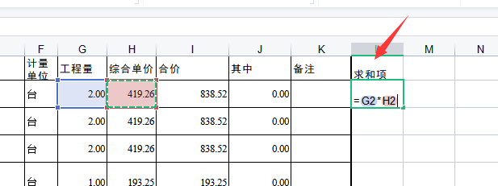
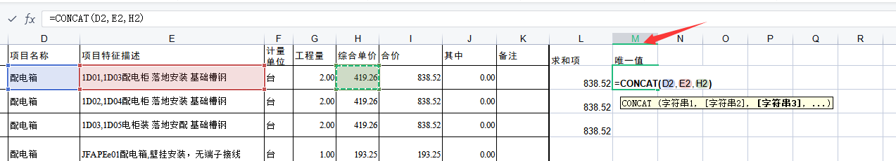
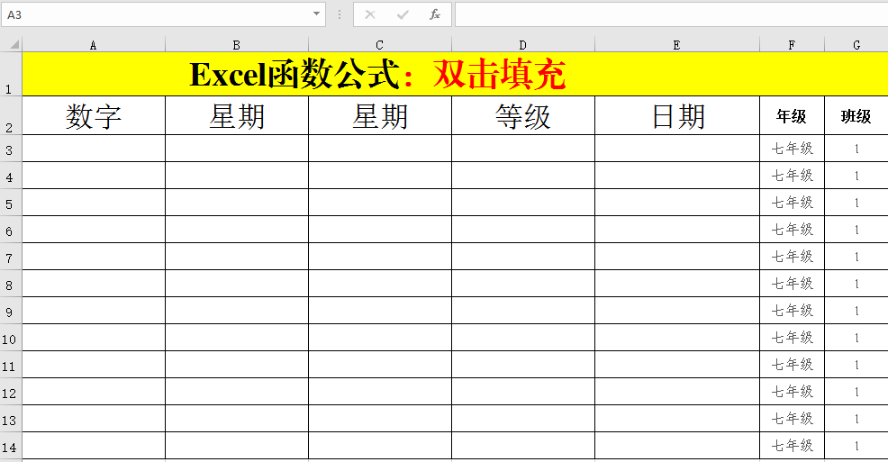
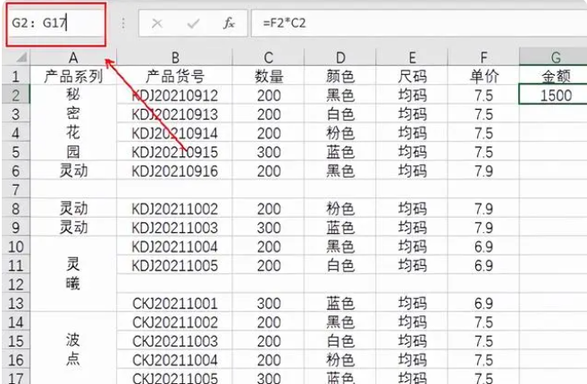

-
-
- id:: 649d3f68-2650-432c-9818-b48ed71c4025
- [[Excel/场景]]
  id:: 648a7df2-2ebc-4fc0-b7c3-1d15c703c681
	- 相同项汇总合并，删除多余值，保持顺序 #2023-06-15
	  collapsed:: true
		- 合并所有工作表
		  logseq.order-list-type:: number
			- 使用vba代码合并 #Excel/VBA  按zlt+f11
			  logseq.order-list-type:: number
				- logseq.order-list-type:: number
				  ```vba
				  Sub 合并当前工作簿下的所有工作表()
				  On Error Resume Next
				  Application.ScreenUpdating = False
				  Application.DisplayAlerts = False
				  Set st = Worksheets.Add(before:=Sheets(1))
				  st.Name = "合并"
				  For Each shet In Sheets:
				  If shet.Name <> "合并" Then
				  i = st.Range("A" & Rows.Count).End(xlUp).Row + 1
				  shet.UsedRange.Copy
				  st.Cells(i, 1).PasteSpecial Paste:=xlPasteAll
				  End If
				  Next
				  Application.DisplayAlerts = True
				  Application.ScreenUpdating = True
				  MsgBox "已完成"
				  End Sub
				  ```
			- 用Python pandas合并所有工作表
			  logseq.order-list-type:: number
			- 用[免费在线合并 Excel 个文件 (aspose.app)](https://products.aspose.app/cells/zh/merger) 合并所有工作表
			  logseq.order-list-type:: number
		- 备份表格（1） | 添加辅助列
		  logseq.order-list-type:: number
			- 添加顺序列：自增序号，保证原始序列顺序
			  logseq.order-list-type:: number
				- 
				  logseq.order-list-type:: number
			- 添加校对列：为求和项再次在Excel中求和，因为原表的求和值可能要大于Excel求和值。为了后面验证合并完的结果是否一致，需要在这里求和。
			  logseq.order-list-type:: number
				- 
				  logseq.order-list-type:: number
			- 添加唯一值列：将多列构成的重复项，用  `=ConCat` 连接，构成唯一项目
			  logseq.order-list-type:: number
				- 
				  logseq.order-list-type:: number
			- 填充所有行
			  logseq.order-list-type:: number
				- 方法
				  logseq.order-list-type:: number
					- 
					  logseq.order-list-type:: number
				- **Excel遇到空行时双击填充无法直接到最后一行**
				  logseq.order-list-type:: number
					- 请添加一列连续的辅助列。
					  logseq.order-list-type:: number
					- 选中单元格后按Ctrl+D
					  logseq.order-list-type:: number
						- 选中单元格
						  logseq.order-list-type:: number
							- 方法1
							  logseq.order-list-type:: number
								- 
								  logseq.order-list-type:: number
							- 方法2
							  logseq.order-list-type:: number
								- 先单击第二行，再移动到最后一行，按住shift点击最后一行
								  logseq.order-list-type:: number
						- 按 Ctrl+D
						  logseq.order-list-type:: number
		- 备份表格（2） | 删除冗余行
		  logseq.order-list-type:: number
			- 排序校对，删除冗余行，避免插入 **数据透视表** 时产生多余行
			  logseq.order-list-type:: number
			- logseq.order-list-type:: number
		- 汇总校对 | 数值确认
		  logseq.order-list-type:: number
			- 防止删错数据
			  logseq.order-list-type:: number
		- 选中全部，状态栏选中 `插入` 点击  `数据透视表`
		  logseq.order-list-type:: number
			- 行：`唯一值`
			  logseq.order-list-type:: number
			- 值：`合并值`
			  logseq.order-list-type:: number
			- 筛选器：`项目名称` 可选
			  logseq.order-list-type:: number
				- 我这里必选，下面将演示如何在筛选的结果中做各种操作。
				  logseq.order-list-type:: number
			- 根据行，做升序排序
			  logseq.order-list-type:: number
		- 备份表格（3）| 数据筛选与处理
		  logseq.order-list-type:: number
			- 筛选不需要合并的项目  | 与数据透视表保持一致
			  logseq.order-list-type:: number
			- 根据唯一值升序排序 | 与数据透视表保持相同
			  logseq.order-list-type:: number
		- 备份表格（4）| 删除重复项目
		  logseq.order-list-type:: number
			- 建议过程：
			  logseq.order-list-type:: number
				- {{embed ((648a866d-8bdf-441b-add9-a88c48e11a3d))}}
				  logseq.order-list-type:: number
			- logseq.order-list-type:: number
		- 备份表格（5）| 数据同步
		  logseq.order-list-type:: number
			- 将数据透视表中的数据，拷贝至工作表中即可。
			  logseq.order-list-type:: number
		- 备份表格（6）| 数据还原
		  logseq.order-list-type:: number
			- 取消筛选项，显示所有项目
			  logseq.order-list-type:: number
			- 按照排序列恢复原始排序
			  logseq.order-list-type:: number
			- 校验总值是否与原表相同
			  logseq.order-list-type:: number
			- 可选
			  logseq.order-list-type:: number
				- 删除辅助列/唯一值列/筛选控制列
				  logseq.order-list-type:: number
		- 手动其他数值合并 | **注意合并项目倍数汇总**
		  logseq.order-list-type:: number
			- logseq.order-list-type:: number
	- up vba test [[2023-06-29]]
		- `在excel中，添加一列名叫“序号列”，从第二行开始，从1一直自增到最后一行。用vba实现`
		  collapsed:: true
			- ```java
			  Sub AddSerialColumn()
			      Dim lastRow As Long
			      Dim serialRange As Range
			      Dim i As Long
			      
			      ' 获取最后一行的行号
			      lastRow = Cells(Rows.Count, 1).End(xlUp).Row
			      
			      ' 在第一列插入"序号列"
			      Columns(1).Insert Shift:=xlToRight
			      
			      ' 设置"序号列"标题
			      Cells(1, 1).Value = "序号列"
			      
			      ' 从第二行开始填充序号
			      For i = 2 To lastRow
			          Cells(i, 1).Value = i - 1
			      Next i
			      
			      ' 自动调整列宽
			      Columns(1).AutoFit
			  End Sub
			  ```
		- `在excel中，添加一列名叫“唯一值”，用=CONCAT()拼接列D,E,H，并填充至第一行中最后一个有内容的列的后面一列。用vba实现`
		  collapsed:: true
			- ```java
			  Sub AddUniqueColumn()
			    Dim lastColumn As Long
			    Dim i As Long
			    
			    ' 获取第一行中最后一个有内容的列的列号
			    lastColumn = Cells(1, Columns.Count).End(xlToLeft).Column
			    
			    ' 在最后一列后插入"唯一值"列
			    Columns(lastColumn + 1).Insert Shift:=xlToRight
			    
			    ' 设置"唯一值"列标题
			    Cells(1, lastColumn + 1).Value = "唯一值"
			    
			    ' 从第二行开始填充唯一值
			    For i = 2 To Cells(Rows.Count, 1).End(xlUp).Row
			        ' 拼接列D、E和H
			        Cells(i, lastColumn + 1).Formula = "=CONCAT(D" & i & ", E" & i & ", H" & i & ")"
			    Next i
			    
			    ' 执行计算以获取实际值
			    Calculate
			    
			    ' 自动调整列宽
			    Columns(lastColumn + 1).AutoFit
			  End Sub
			  ```
		- `在excel中，添加一列名叫“唯一值”，用=CONCAT()拼接列名称为“项目名称”“项目特征描述”“综合单价”的列，并填充至第一行中最后一个有内容的列的后面一列。用vba实现`
		- 复杂excel做成脚本
		- excel操作录制成脚本？
		-
	-
	- 时间统计
		- 若出现数据校对，60min
		- 数据校对正常，17min
	-