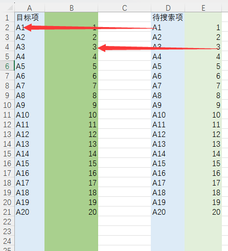

-
-
	- 常用命令
	  collapsed:: true
		- 拼接字符串
			- `=CONCAT(,)`
		- 多替换
			- 用VLOOKUP实现吧，SUBSTITUTE嵌套有次数限制。
			- NOW 示例
			  :LOGBOOK:
			  CLOCK: [2023-05-23 Tue 11:00:55]--[2023-05-23 Tue 11:00:55] =>  00:00:00
			  CLOCK: [2023-05-23 Tue 11:00:56]--[2023-05-23 Tue 11:00:56] =>  00:00:00
			  CLOCK: [2023-05-23 Tue 11:01:27]
			  :END:
		- 查找匹配
			- VLOOKUP
			  id:: 645a4646-6290-4a64-ad7e-29fd85a7f016
				- `=VLOOKUP(A2,D:E,2,0)`
				  collapsed:: true
					- 
				- `=IFERROR(VLOOKUP(W76,Sheet1!Q:R,2,0),)`
					- VLOOKUP(W76,Sheet1!Q:R,2,0)
						- W76 为A列，为目标查找项。
						- Sheet1!Q:R，为待查询列Q，以及值R。
						- 2为列数，
						- 0为
				- ```
				  VLOOKUP(lookup_value, table_array, col_index_num, [range_lookup])
				  ```
					- 参数说明：
						- lookup_value：要查找的值，可以是一个具体的值、单元格引用或者是某个表达式。
						- table_array：要进行查找的表格范围，包括要查找的值和相关值。该范围通常以表格或数据区域的引用形式表示，例如A1:B10。
							- 好像不一定要在最左边。
						- col_index_num：[[$red]]==要返回的相关值所在列的索引号。==索引号从表格范围的第一列开始算起，例如1表示第一列，2表示第二列，以此类推。
						- range_lookup：可选参数，用于指定查找方式。设置为TRUE或省略时表示采用近似匹配方式（查找值不必完全匹配），设置为FALSE则表示采用精确匹配方式（查找值必须完全匹配）。
				- VLOOKUP 匹配不出，原因之一：含有“~”这个符号
					- `=IFERROR(VLOOKUP(SUBSTITUTE(W76,"~","~~"),Sheet1!Q:R,2,0),)`
				- 双列不能分开，必须在一起。
				-
			-
	-