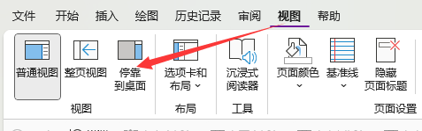
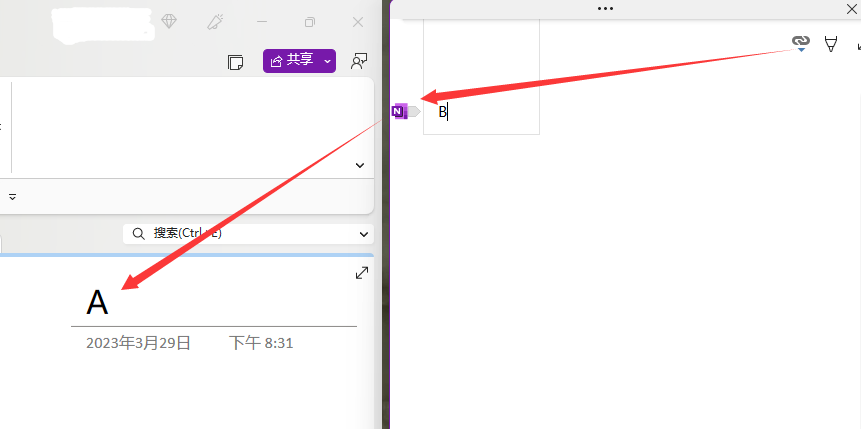
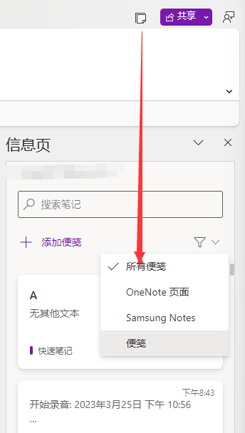

- [[OneNote]] a kind of [[NoteApp]]
	- 当我们加了这个标签，noteapp里就可以看到我这个内容，这很棒，我们有了联系
	- 下面这些信息，仅仅就只是onenote的东西。他和其他东西没有任何联系。这个信息就应该在这里。
	- 语音转换
	  collapsed:: true
		- Office 365版本
		  collapsed:: true
			- 录音
			  collapsed:: true
				- Onenote的录音能够将录音的时间戳附着在Page的操作上。即在文本处可以跳转到当时的事件。
			- 转录
			  collapsed:: true
				- 即实时将声音在Page内转换成文本。自带标点符号，但是不自动换行。
			- 以上两个功能可以合起来用，转录的同时将会附着语音时间戳。但注意，因为转录不能换行，所以实际上并不能自动将语句和每一个时间段附着，实际情况是一大段附着1个时间点。
			  collapsed:: true
				- 当然，只要手动换行，就能解决这个问题。
				- 但咱就是不想手动怎么办？
			- 眷写
			  collapsed:: true
				- 眷写能记录笔迹顺序
				- 1. 录音，对，就是个录音功能。当你点完成后，自动转换成文本+时间戳。
				- 2.可以上传录音文件，然后文字识别，同时附上时间戳。
			- 同功能产品其他：
			  collapsed:: true
				- 飞书妙记：支持视频识别
		- Windows - UWP
		  collapsed:: true
			- 录音
			- 转录
			- 有附着
			- 没眷写
		- 安卓-手机端
		  collapsed:: true
			- 仅支持录音或转录。
			- 录音仅支持3：00
			- 录音时无法操作
		- 安卓-平板
		  collapsed:: true
			- 只能录音，还没有转录。
		- Web端
		  collapsed:: true
			- 录音
			- 转录
			- 没附着
			- 且看不到附着
		- Mac
		  collapsed:: true
			- 没有眷写，只有转录和录音，附着不清楚
	- 单链 -> Word 、OneNote、PPT
	  collapsed:: true
		- 1.停靠在桌面
		  collapsed:: true
			- 
		- 2.在**Word**、Onenote、PPT、网页(只支持IE，笑)中某位置点一下位置A，再到侧栏编辑B。B即可绑定到A
		  collapsed:: true
			- 
	- 信息页 -> 便笺 / Samsung Note
	  collapsed:: true
		- 这里能全平台看到Windows应用：便笺里的内容。
		  collapsed:: true
			- 
			- 这小东西还挺好用的，除了便捷，就是便捷。
			- 手机端在OneNote，Office里都能查看。
			- 电脑端在OutLook Office版也能看见
		- 还能看到三星笔记里的Page，笔迹会转换成图片。
		- 
	- 全平台同步
	  collapsed:: true
		- 世界上所有的平台都能查看，都能同步。
		-
	- other
	  collapsed:: true
		- [(20条消息) onenote快捷键_onenote链接系列：4种链接笔记的地址_weixin_39929377的博客-CSDN博客](https://blog.csdn.net/weixin_39929377/article/details/111283794)
		-
-