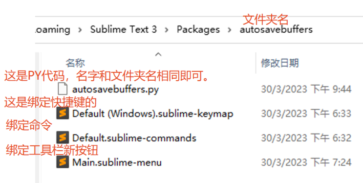
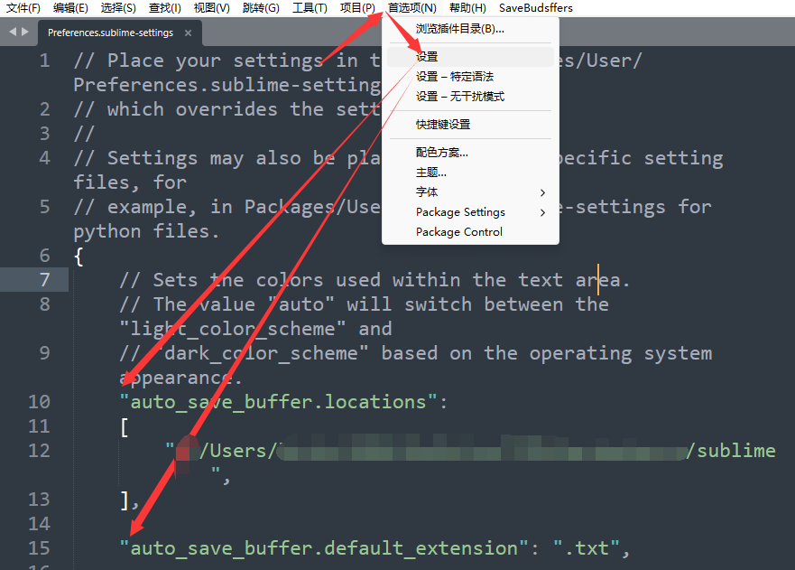

- 通过 [[Notion/blog]] 下载我的 [[Sublime Text 3]] 插件
  id:: 64345711-ca91-4fba-a27a-d8b0e4226c8d
	- [Sublime3 插件 (fpb.icu)](https://blog.fpb.icu/RovKXqaF0Szb13)
-
	- #2023-03-30
		- 在 [[Sublime Text 3/Plugin]] 中用 [[python]] 插件 重命名所有新 临时标签页 ， 并一键保存 所有临时文件到指定目录。
			- 相关链接
			  collapsed:: true
				- [How to auto-save unsaved tabs in Sublime Text? - General Discussion - Sublime Forum](https://forum.sublimetext.com/t/how-to-auto-save-unsaved-tabs-in-sublime-text/62376/9)
				- [sublime 插件和创建代码片段_sublime_text_build_4143_x64_setup.exe_幸运学者的博客-CSDN博客](https://blog.csdn.net/weixin_43649647/article/details/123439190)
			- 使用插件
			  id:: 64341f75-92e6-48e0-b929-193dbfcf1743
			  collapsed:: true
				- `ctrl + ~` 打开terminal
				- 文件结构
				  collapsed:: true
					- 
				- autosavebuffers.py
				  collapsed:: true
					- ```PYTHON
					  import sublime
					  import sublime_plugin
					  import os
					  import uuid
					  from datetime import datetime
					  from tempfile import gettempdir
					  
					  #plan
					      #通过日期创建文件夹
					  
					  
					  #监听器，监听新标签页，并设置名称和路径。
					  class TemporaryFileEventListener(sublime_plugin.EventListener):
					      #print("服务开始-》标签监听器启动")
					      def on_new(self, view):
					          #print("<<<<<<<<<<<")
					          #print("检测到新窗口，初始化名称")
					  
					          #调用方法，获取目标保存位置。
					          tmp_dir = get_temp_dir(view)
					          #print("设定的tmp_dir是:{}".format(tmp_dir))
					  
					          #如果工作区没有目标目录，则啥也不干。
					          #因为我指定固定目录，所以这里注释掉。
					          #if tmp_dir is None:
					          #    return
					  
					          #获取设置的后缀，默认是.txt
					          ext = view.settings().get("auto_save_buffer.default_extension", ".txt")
					  
					          now = datetime.now().strftime("%Y-%m-%d_%H%M%S")
					  
					          #print("生成的now是:{}".format(now))
					          rnd = str(uuid4())[:8]
					          #print("生成的rnd是:{}".format(rnd))
					  
					          tmp_name = "{}-{}{}".format(now, rnd, ext)
					          #print("设定的tmp_name是:{}".format(tmp_name))
					  
					  
					          #print(">>>>>>>>>>>")
					  
					          #给每个新标签页 设置属性.
					          view.settings().set("_tmp_dir", tmp_dir)
					          view.settings().set("_tmp_name", tmp_name)
					          view.settings().set("default_dir", tmp_dir)
					          #设置标签名
					          view.set_name(tmp_name)
					  
					      def on_save(self, view):
					          #print("保存时，去除名字？")
					          view.settings().erase("_tmp_dir")
					          view.settings().erase("_tmp_name")
					  
					  
					  #这个命令通过快捷键/命令/等调用。运行run方法。
					  class SaveTemporaryBuffersCommand(sublime_plugin.WindowCommand):
					      """
					      当执行该命令时，该命令在当前窗口中寻找所有具有指定临时名称的文件强制将它们保存指定文件夹中，并使用该名称。
					      """
					      def run(self):
					          #print("保存启动")
					  
					          for view in self.window.views():
					              #print("保存开始")
					  
					              tmp_name = view.settings().get("_tmp_name")
					              #print("tmp_name是:{}".format(tmp_name))
					              
					              #没名字，肯定左栏没文件夹。
					              if tmp_name is not None:
					                  tmp_dir = view.settings().get("_tmp_dir")
					                  #print("tmp_dir是:{}".format(tmp_dir))
					                  
					                  #合并路径和名称->文件绝对路径。
					                  filename = os.path.join(str(tmp_dir), str(tmp_name))
					  
					                  #若文件不存在，同时名称未改动。则保存。retarget什么意思？
					                  if not os.path.exists(filename) and view.name() == tmp_name:
					                      view.retarget(filename)
					                      view.run_command("save")
					                      print("保存成功")
					              #还是不要删除这个变量了吧。有时候会先删除本地文件，而缓存还在。这样就不容易再保存，或者关闭了。
					              #不知道，这个变量不删掉，有没有啥不好？
					              #view.settings().erase("_tmp_name")
					              #view.settings().erase("_tmp_dir")
					  
					  
					  
					  def get_temp_dir(view):
					      #这里我个人直接返回目标目录，下面代码流程我不需要。   
					      return "f:/Users/birdy.OMEN/OneDrive/文档/backuphours/sublime"
					  
					      #TODO START
					          #若左工作栏有临时目录，或配置文件中设置的目录的父级目录，则返回目录。
					          #若没有，则返回NONE。
					      #END
					  
					      #给定一个view（新临时标签页）
					      #配置文件中设置的子位置，获取临时标签页的临时位置，返回的是个list
					      dirs = view.settings().get("auto_save_buffer.locations", [gettempdir()])
					      #print("配置文件中的dirs是:{}".format(dirs))
					  
					  
					      # 获取窗口中可用的文件夹 位置 ，该列表可能为无
					      window = view.window() or sublime.active_window()
					      folders = window.folders() or []
					      #print("侧栏存在的文件夹folder是 {}".format(folder))
					  
					      # 迭代左栏中，文件夹
					      for folder in folders:
					          #检测有没有符合咱设置的目录的。如果有，就优先返回左侧栏的文件夹。
					          if folder in dirs:
					              #print("dirs")
					              return folder
					  
					  #   return None
					  
					  ```
				- Default (Windows).sublime-keymap
				  collapsed:: true
					- ```java
					  [
					  	{ "keys": ["ctrl+alt+shift+s"], "command": "save_temporary_buffers" }
					  	//command后面是py文件内的类名
					  ]
					  
					  ```
				- Default.sublime-commands
				  collapsed:: true
					- ```java
					  [
					      {
					          "caption": "savebuffers: save_temporary_buffers ",
					          "command": "save_temporary_buffers"
					      }
					  ]
					  
					  ```
				- Main.sublime-menu
				  collapsed:: true
					- ```java
					   [
					      {"id":"autosavebuffers","caption": "SaveBudsffers","command": "save_temporary_buffers"}
					          //id是标识
					          //caption是显示的名字
					          //command后面是py文件内的类名
					  
					  ]
					  ```
				- 环境变量设置：
				  collapsed:: true
					- ```java
					  	"auto_save_buffer.locations":
					  	[
					        	#这里可以输入也可以不输入，可以在py文件里定死。
					          #这里设置的主要目的其实是为了筛选左侧栏工作区文件夹，什么意思看py里的注释
					  	 	"backup/sublime",
					  	],
					  		#这里设置默认后缀，如果改成md就是保存成md文件。
					  	"auto_save_buffer.default_extension": ".txt",
					  ```
					- 
			- 方法2
			  collapsed:: true
				- 直接把 appdata 下的 文件都删掉就好了
	- #2023-04-11
		- {{embed ((6434579c-4f76-4e04-8c1e-728b3309dc0f))}}
	- #2023-04-10
		-
		- {{embed ((6434561b-1eb9-41a8-9b6c-bc2e44ec08ae))}}
	-
-
-
-