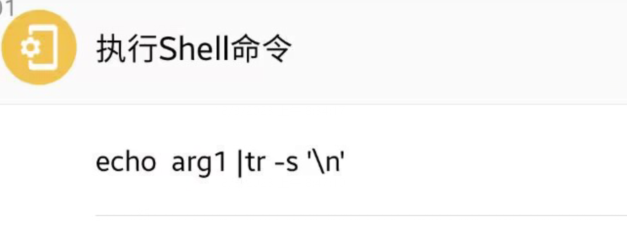

alias:: fooview

-
- 用[[fv]]屏幕控件获取内容：
	- `[快捷选项 (619,1552 - 821,1617),分屏分割线 (548,1469 - 891,1571),阅读 (0,1534 - 1440,1835),第2周 (60,1895 - 1380,1982),阅读第 1 个标签，共 4 个 (0,2885 - 360,3026),分析第 2 个标签，共 4 个 (360,2885 - 720,3026),书架第 3 个标签，共 4 个 (720,2885 - 1080,3026),学习第 4 个标签，共 4 个 (1080,2885 - 1440,3026),人間なら誰しも (0,444 - 1440,566),显示翻译 (24,614 - 232,713),1 (84,862 - 108,919),なら (180,836 - 250,893),如果 (180,905 - 264,956),Play word tts (299,841 - 347,889),Play word tts (299,1048 - 347,1096),Play word tts (346,1255 - 394,1303),1 (84,1069 - 108,1126),人間 (180,1043 - 250,1100),人的 (180,1112 - 264,1163),1 (84,1276 - 108,1333),誰しも (180,1250 - 297,1307),大家 (180,1319 - 264,1370),快捷选项 (619,18 - 821,83)]`
- 在[[fv]]删除文本 空行 空换行
	- 用shell来删除,因为js预处理把换行都删了。
	- 
- [[shell]]调用 [[fv]]任务
  id:: 64241525-6c82-4d6f-bdd6-a9865c95560b
	- `am start "intent:#Intent;action=com.fooview.android.intent.RUN_WORKFLOW;component=com.fooview.android.fooview/.ShortcutProxyActivity;S.action=arg1;end"`
	- `arg1就是你的自定义任务名字`
-
-