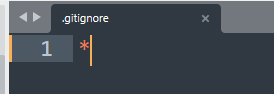
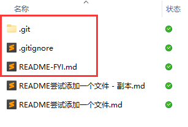

-
	- 尝试用.ignore来解决 [[logseq]]  自动 [[git]] 同步对非git库操作而导致的错误提醒
	  collapsed:: true
		- 很好，对于仓库中已经存在着的文件的更改是可以更新的。
		  collapsed:: true
		  但是其他所有文件就全部无视掉了。
			- 
			- 
				- 所以，我们复制3个文件.git readme.me .gitignore到其他我们不想被提醒git失败的非git仓库中即可。
		- 反馈
			- 不行，已经取消自动了。即使是忽略，他是会提示你。 [[2023-04-08]]
	- [[logseq]] 双端同步 简介 #2023-03-31
	  collapsed:: true
		- logseq自带的，最高600秒自动push，每秒进行pull。
		- 插件中的Git，只能每秒自动push，自动pull没试出来。不过可以在header上手动控制git。
		- [CharlesChiuGit/Logseq-Git-Sync-101: This repo aims to help Logseq users to sync their data with Git and GitHub.](https://github.com/CharlesChiuGit/Logseq-Git-Sync-101)
			- 这里有windows和pc的相关设置。
			- 安卓用了[[termux]]来进行[[git]]管理，用 [[tasekr]]来自动化。
	- [[logseq]]用 [[chatgpt]]插件来总结每日日记。#2023-03-31
	  collapsed:: true
		- 其实不行，有时有代码，内容太长。
	- 不要用 [[logseq]]excalidraw ，可以用 Sketchbook、![]draw.io 做替代，把 Sketchbook 或draw.io的文件插到块里截个图就行。#2023-03-31